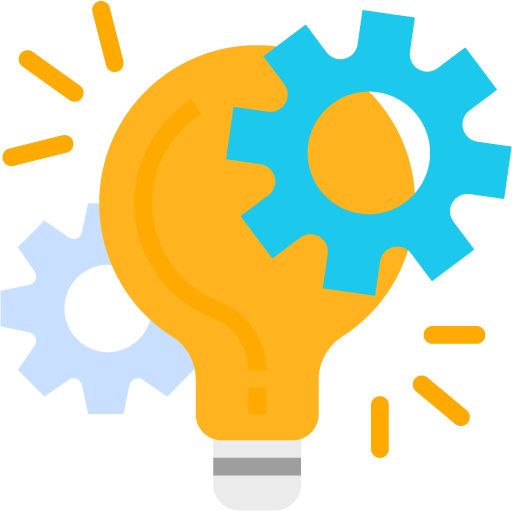

<!-- PROJECT LOGO -->
 

  

  <h2 align="center">Integrated Supervision And Evaluation System</h2>

  

    A system in which students, faculty, and faculty members can join and work together to improve the defense process by better managing sessions, better coordination between faculty and referees. 
     
     
    ·
    <a href="https://github.com/Borjianamin98/supervision-and-evaluation-system/issues">Report Bug</a>
    ·
    <a href="https://github.com/Borjianamin98/supervision-and-evaluation-system/issues">Request Feature</a>
  

<!-- TABLE OF CONTENTS -->

  
Table of Contents

  <ol>
    <li>
      <a href="#about-the-project">About The Project</a>
      <ul>
        <li><a href="#built-with">Built With</a></li>
      </ul>
    </li>
    <li>
      <a href="#getting-started">Getting Started</a>
      <ul>
        <li><a href="#prerequisites">Prerequisites</a></li>
        <li><a href="#installation">Installation</a></li>
      </ul>
    </li>
    <li><a href="#usage">Usage</a></li>
    <li><a href="#contributing">Contributing</a></li>
  </ol>

## About The Project

In the old approach, in order to perform the work related to the presentation of the final project, dissertation, proposal and transfer of information, face-to-face methods were used to coordinate with professors, education officials, etc. Also, for sharing information such as the text of the dissertation or proposal, research results and developments, etc., various systems such as e-mail and similar items were used, which due to the large number of students and the busy people involved in this process, these messages and information are not centralized. Also it was very time consuming to follow their history and a lot of time was spent on the necessary coordination and the possibility of error in these coordination was high.

In web-based systems, all of this can be done by saving time and resources, without space constraints, and with greater accuracy by documenting the relationship between faculty and students. This system improves the communication between students and professors by creating a user-friendly environment and accelerates access and process-related handling of projects. With this system, the student does not need to spend money to travel, get in touch with professors, etc. to travel, wait in the professors' office, share information between all professors, and so on. This system also helps professors and the educational system to reduce the number of appointments, better coordination in the process of division and determining the time of presentation, and so on.

Given the increasing number of students over time, the greater involvement of our daily lives with technology and the above, the use of such a system in the near future is essential. 

### Built With

* [React](https://reactjs.org/)
* [Spring boot](https://spring.io/projects/spring-boot)

<!-- GETTING STARTED -->
## Getting Started

### Prerequisites

### Installation

## Usage

